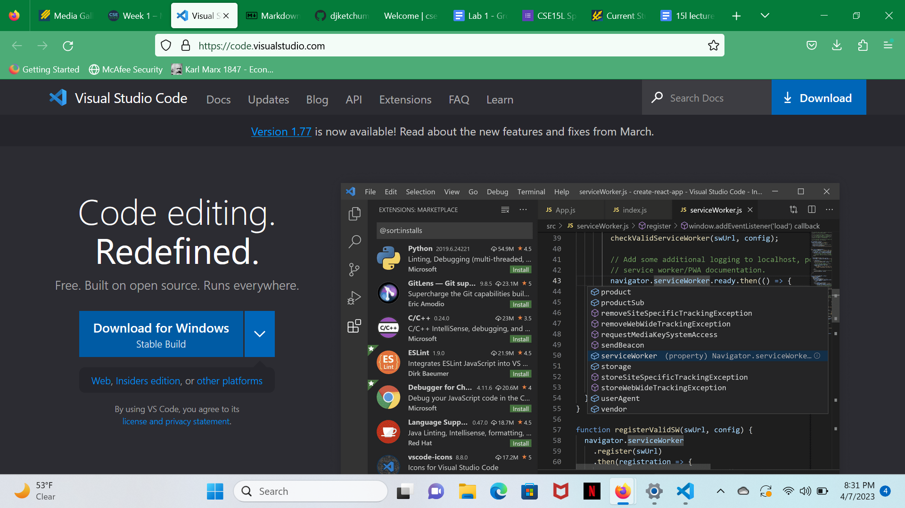
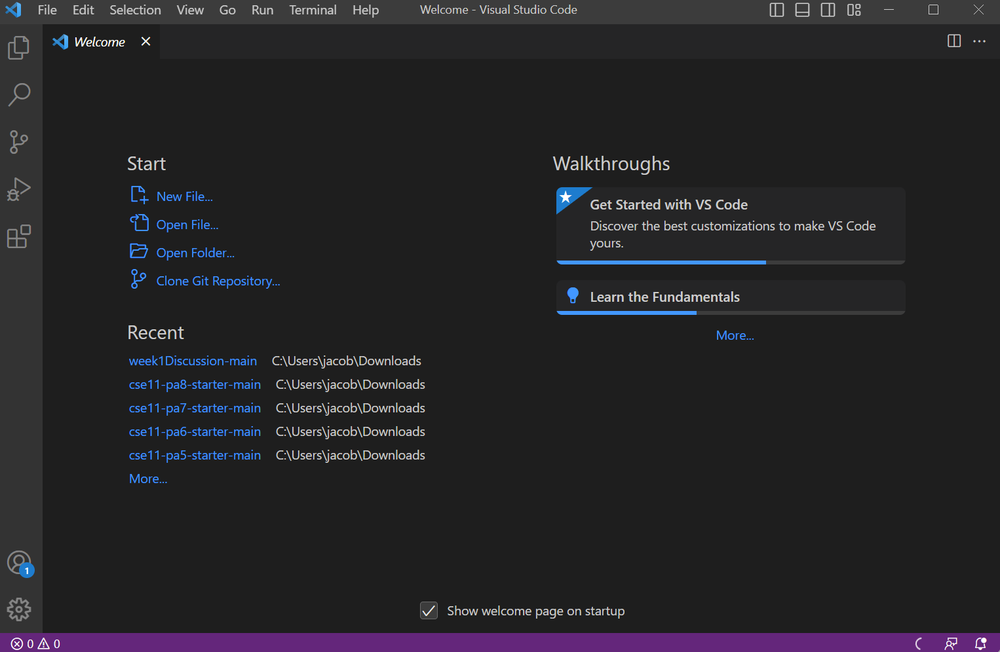
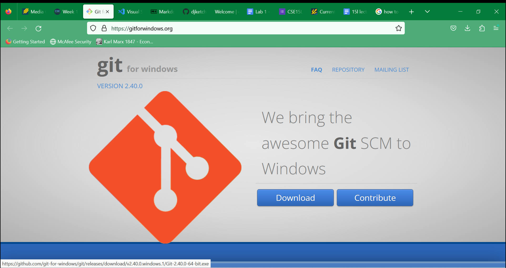
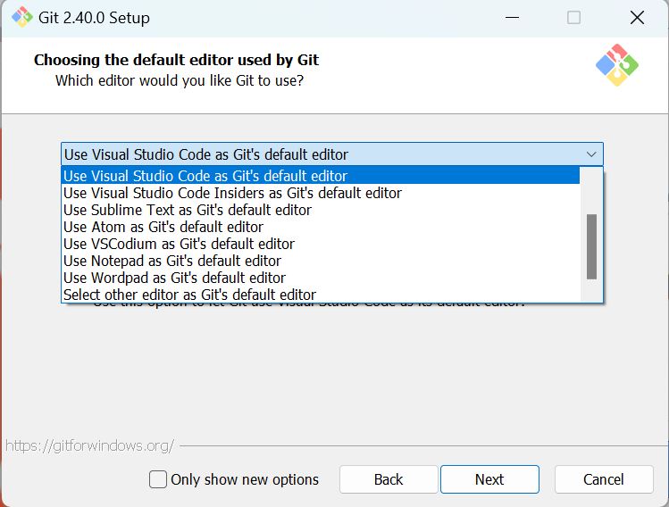
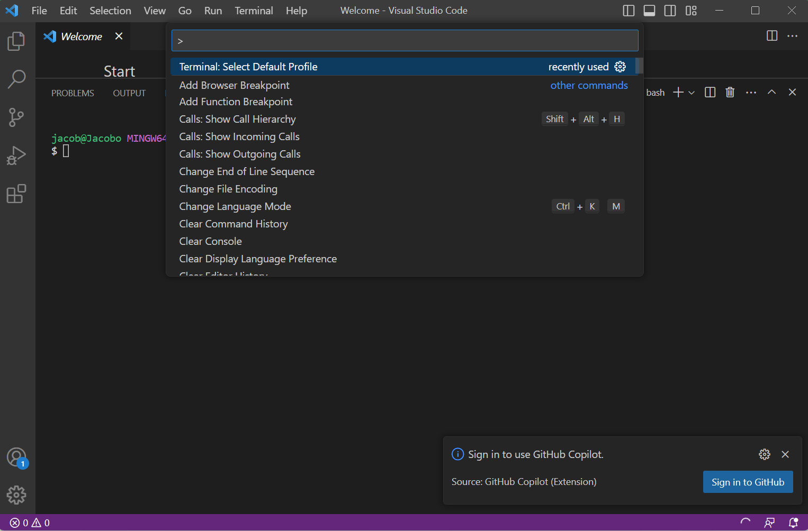
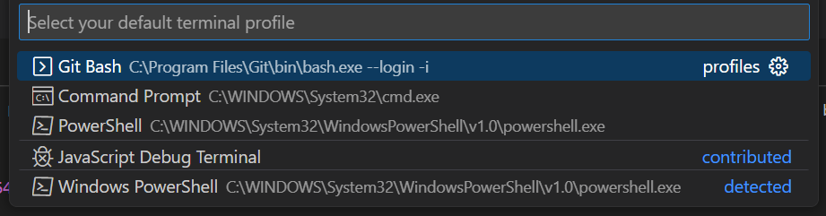
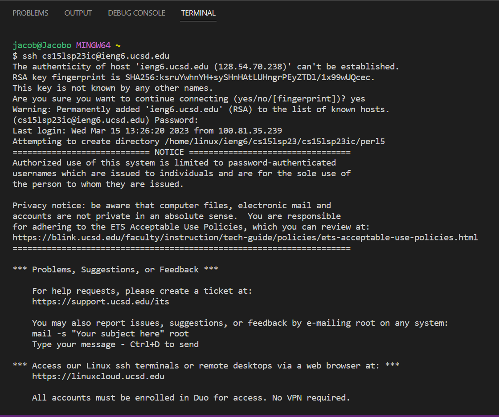
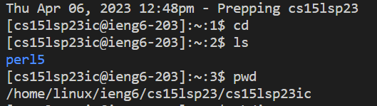

 # Lab Report 1
 
 ## Downloading VS Code for Windows: 
 
 First, open [Link](https://code.visualstudio.com/)
 
You will see this page: 

Then, press the download button and follow through all the steps.
There's no need to update anything, just click your way through until it downloads.
Then, you should see a page like this:

Next, because you're on Windows you need to download Git at this link [Link](https://gitforwindows.org/)
This will open up a screen that looks like this: 

From here, press Download. There is one step you have to manually change, which is shown below.

So, make sure you switch the program Git will be used with to VS Code as shwon above.

Now, we're going to open up a terminal in VS Code by pressing the Terminal option at the very top menu bar on VS Code and pressing New Terminal.
From there, press Ctrl + Shift + P, which should get you looking at something like this:

From here, type in Select Default Profile into the search and select that option when it comes up.
Now, select GitBash, as seen below.

Now you're going to connect your personal account made for 15L to the server.
Open a new terminal and enter the following: 
`ssh cs15lsp23ic@ieng6.ucsd.edu` (ic is my specific code, your two letter code is different)

I will attach an image and walk you through the next few steps of logging in.

Once you get to the 'Are you sure...' prompt, you will type in yes. 
After that, it will prompt you for the password you created with your cse15l account, enter it now.

Lastly, you're gonna try inputting some commands now that you're logged in. 
You can try `cd` , `ls` , `pwd`
This is what it should look like: 

And you're done setting up VSCode and linking your account!
