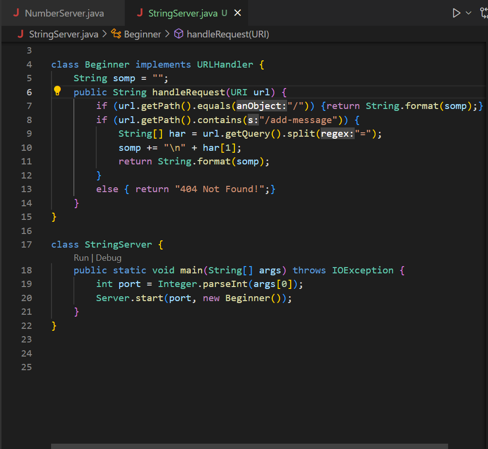

# Part 1: StringServer

Code for StringServer: 

Attached are two runs with the `/add-message` query.

In this screenshot, the main method runs when the port is being created for the server. The port number I used is 4600. Then, the Server.start method from the Server file is called and opens the server up using info from the Beginner class. The next method to be called is handleRequest 

