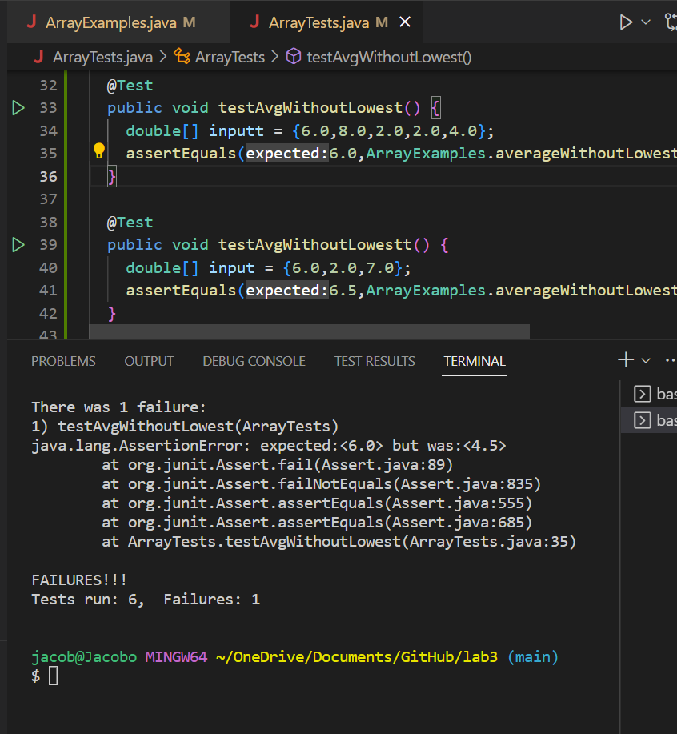
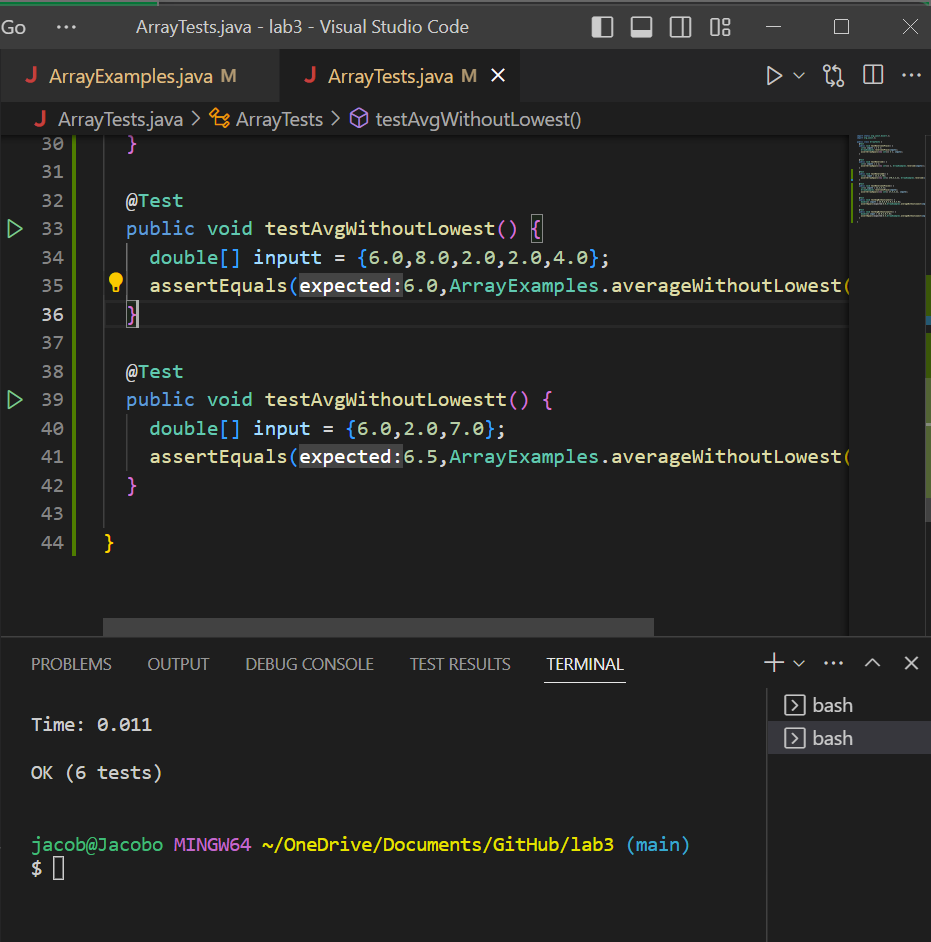

# Part 1: StringServer

Code for StringServer: 


Attached are two runs with the `/add-message` query.

In this screenshot, the main method runs when the port is being created for the server. The arguments for the main method are the String[] args array. The port number I used is 4600. Then, the Server.start method from the Server file is called and opens the server up using the parseInt of args[0] and a new Beginner class object. The next method to be called is handleRequest, whose argument is a url of type URI, which will analyze the contents of the URL and more specifically the query. This run updates the string somp to include "Hello", so it is up to now "Hello" since this was the first run.


In this screenshot, the server is running so the main method is not called, because the main method serves to open the server but we are still using the same one. The first method to be called is handleRequest, whose URI url object is now updated to the current URL shown in the above. This run updates the string somp to include "HOLA", so somp is now "\n + Hello + \n + HOLA".

# Part 2: Debugging

Test that works: 
```
@Test
  public void testAvgWithoutLowestt() {
    double[] input = {6.0,2.0,7.0};
    assertEquals(6.5,ArrayExamples.averageWithoutLowest(input),1.0);
  }
```

Test that doesn't work at first:
```
 @Test
  public void testAvgWithoutLowest() {
    double[] inputt = {6.0,8.0,2.0,2.0,4.0};
    assertEquals(6.0,ArrayExamples.averageWithoutLowest(inputt),1.0);
  }
  ```
  
Symptom: (the top test which expects a value of 6.0 is the one that's failing and producing the symptom) 

  
Code before debugging:
```
static double averageWithoutLowest(double[] arr) {
    if(arr.length < 2) { return 0.0; }
    double lowest = arr[0];
    for(double num: arr) {
      if(num < lowest) { lowest = num; }
    }
    double sum = 0;
    for(double num: arr) {
      if(num != lowest) { sum += num; }
    }
    return sum / (arr.length - 1);
  }
```

Code after debugging: 
```
static double averageWithoutLowest(double[] arr) {
    int i = 0;
    if(arr.length < 2) { return 0.0; }
    double lowest = arr[0];
    for(double num: arr) {
      if(num < lowest) { lowest = num; }
    }
    for(int j = 0; j<arr.length;j++) {
      if(arr[j] == lowest) {i +=1;}
    }
    double sum = 0;
    for(double num: arr) {
      if(num != lowest) { sum += num; }
    }
    return sum / (arr.length - i);
  }
  ```
  The issue here was that the original code only functioned if there was only one singular minimum value in the array. However, some arrays like the one used in the test that failed have the same minimum number multiple times. The main bug was the last line of 'return sum/(arr.length - 1)` because even if there was 10 indeces with the minimum value it would still factor in 9 of those indeces into the division despite those indeces being rightfully excluded from the sum. The solution I had was to make a separate for loop where I take the lowest value which was discovered by the first for loop, and check for equality at every index, using an int to cout how any indeces that lowest value appears at. Then I changed the final line of code to factor in that int value with `return sum/(arr.length - i)`. This fixed the issue.


# Part 3: Reflection
