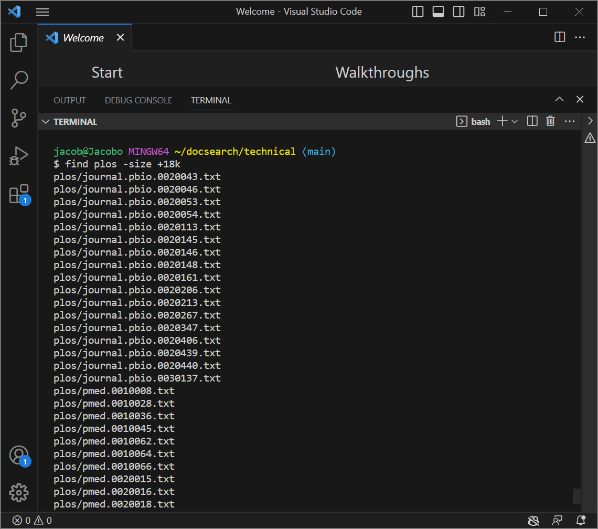
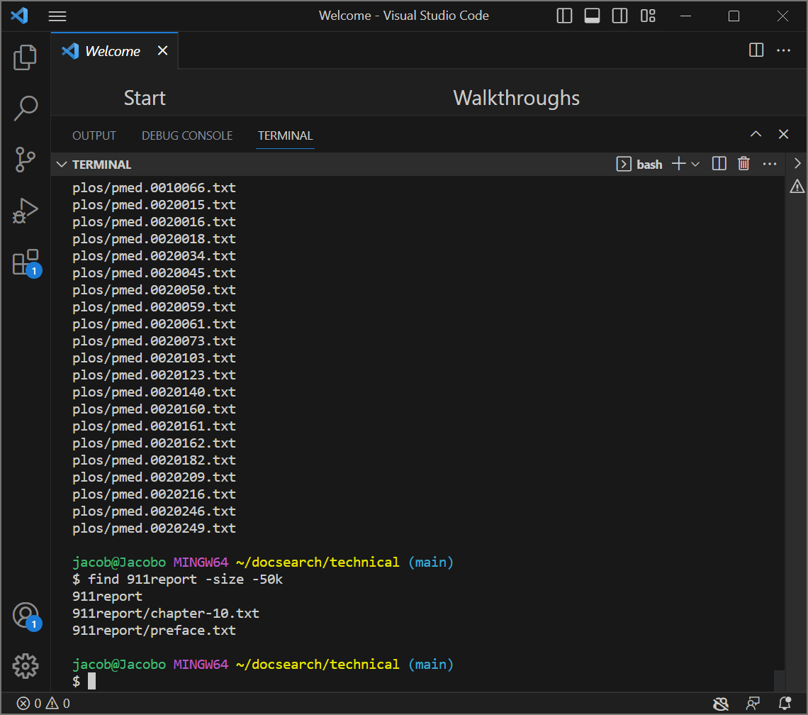
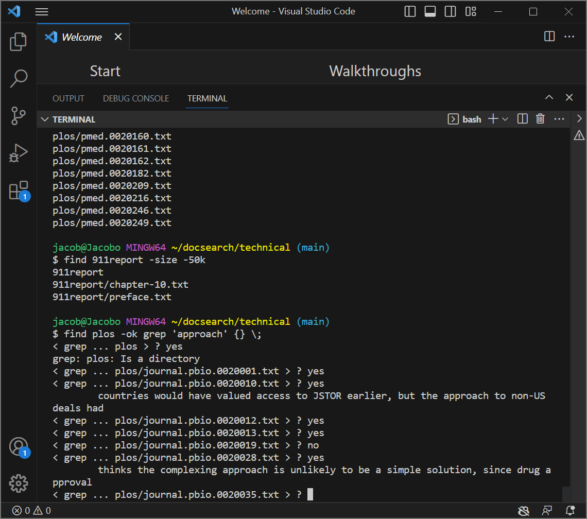
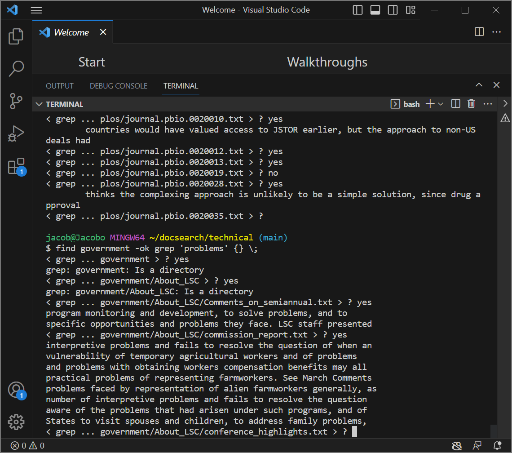
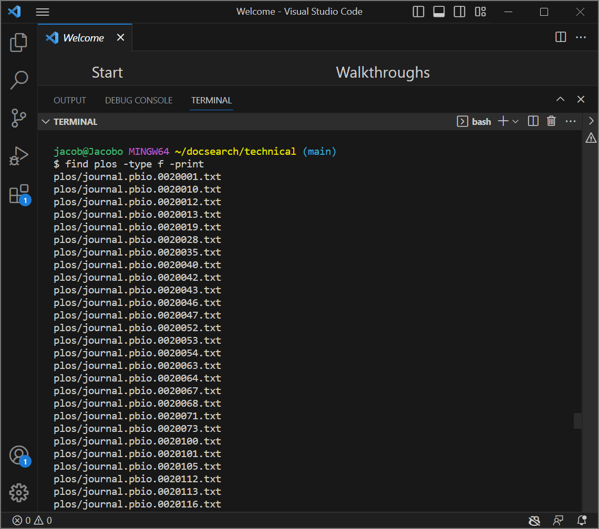
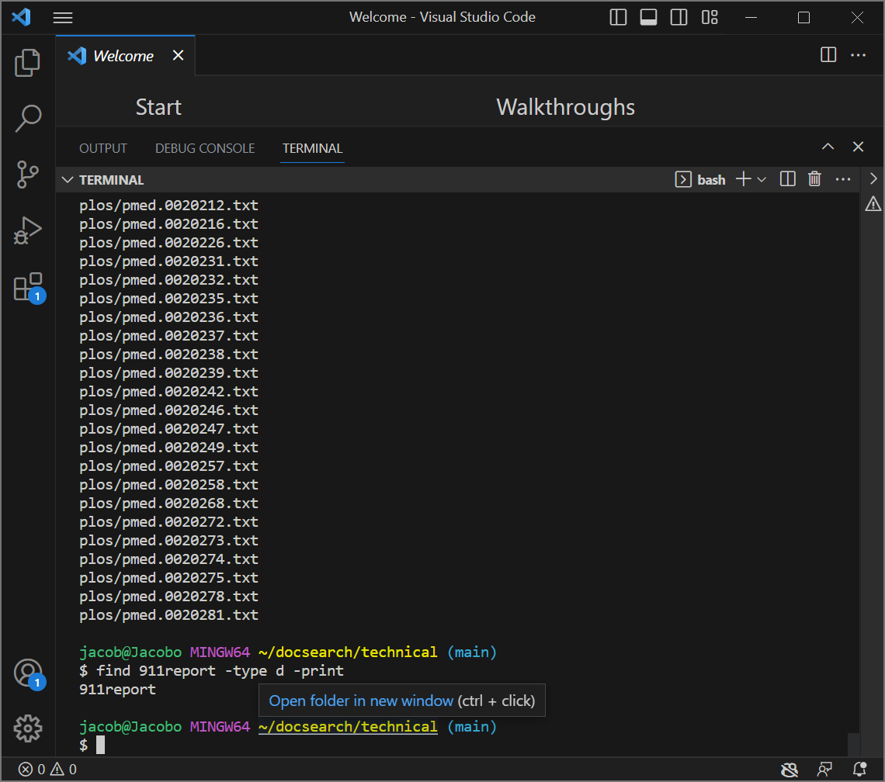
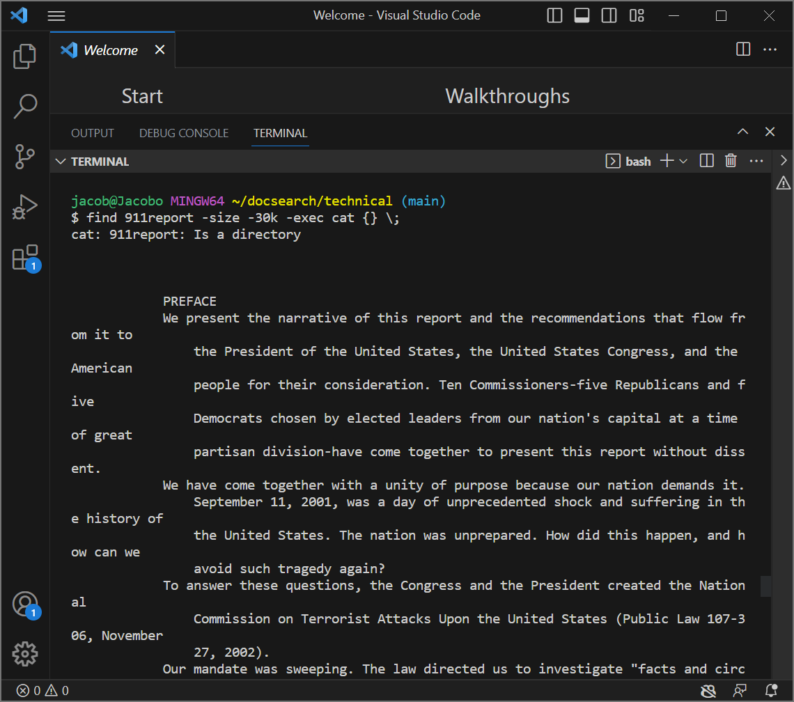
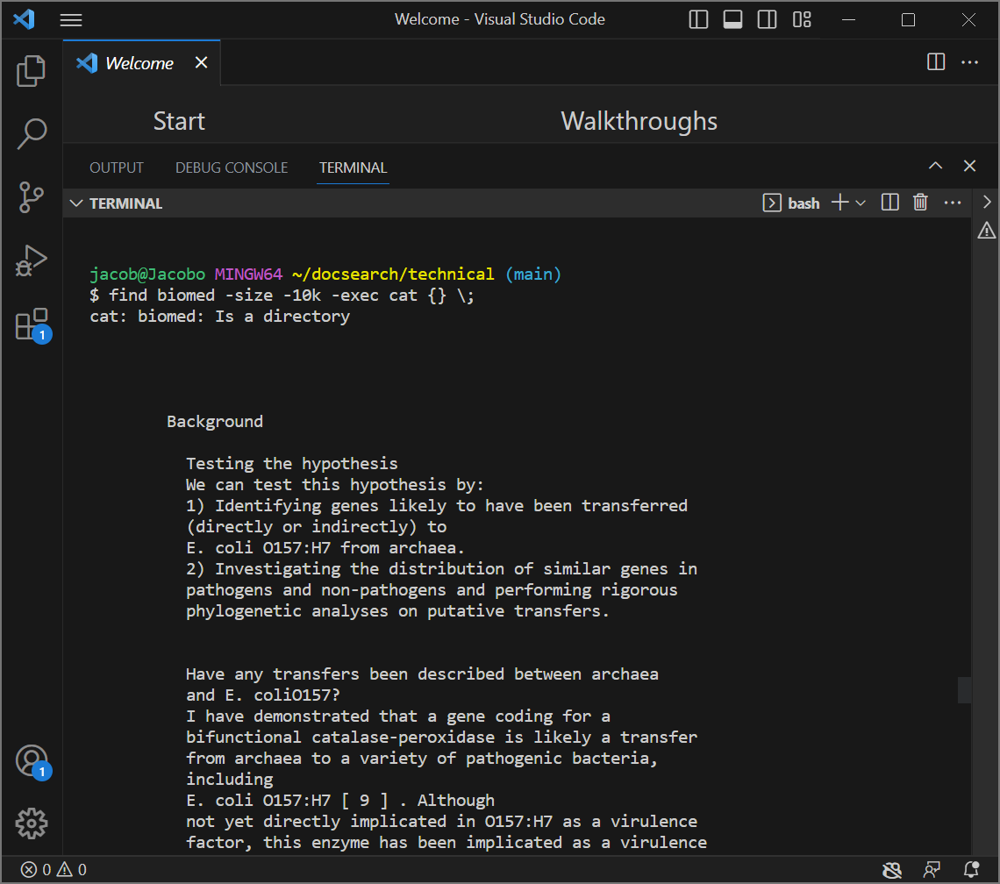

# Exploring Command-Line Options with 'Find' Command

## -size
The first new command line option I found was the -size, which goes through a directory and any subdirectories and returns only the files/directories above or below a certain memory size, depending on how the command is set up. The command can also check for different units of storage such as kilabytes, megabytes, etc, each with their own letter representation. It can also be made to specifically search and return files, or directories, by prefacing the command -size with `-type f` for files or `-type d` for directories.
The command is shown being used below for two different directories, `plos` and `911report`.

Here, the find command takes a path to a directory `plos` and returns only the files/directories with size GREATER than 18 kilabytes, due to the use of `+` before the number. The kilabytes is signified by a lower case k, while b is for bytes, M is for megabytes, and G is for gigabytes.

Here, find is looking inside 911report directory for files or directories UNDER 50 kilabytes, due to the `-` in front of the number, and kilabytes again signified by a lowercase k. The seach returns the directory itself on this search, showing that unless specified by the `-type` function, it will search unambiguously, returning both files and directories. I found the original command `-size` on ChatGPT as well as how to implement it, and other options such as `-type`.

## -ok
The command-line option -ok for find takes a command which is placed after the `-ok`, in this case `-ok grep`, and searches and returns all the lines in each file in the directory that contain whatever string you place after the grep. The syntax I used in the first use of this -ok is `find plos -ok grep 'approach' {} \` , which is looking inside of the plos directory for each file and running the command grep 'approach'. The specific difference between the command `-ok` and similar commands such as `-exec` is that with `-ok` , the terminal will prompt you to enter yes/no for each file it encounters in the directory before it runs the given command, in this case grep.

Here, we see that if you try running the command on a directory it won't work, but this is only due to the nature of the command grep, which is specifically looking inside a file for a string. This means that the -ok command will attempt to run commands on both directories and files. When successful, the output is the lines which contain 'approach'. The terminal will continue to prompt you with every file and directory until there is no more left or you stop it with `Ctrl + c`.

It is worth noting that if you enter no when prompted in regards to a file or directory, it will simply be skipped over. Here, the find command is looking in the directory government and the -ok command inquires with regard to each file and directory in government before running the grep command and searching for the string 'problems' in said file. The information on this command -ok and its implementation is from ChatGPT.

## -type
The -type command-line option for `find` narrows down the search for find down to a specific type, file or directory. A file is signified by `-type f` and a directory by `-type d`.

In this case, find is searching for and printing out all the files found in the plos directory. The `-print` command at the end is just to make all these files print out onto the terminal. 

Here, find searches the directory 911report for any directories or subdirectories, which it prints out into the terminal. 
This information was found on ChatGPT.
## -exec
The -exec command is similar to the -ok command, except that it doesn't prompt the user for input before running a given command on all the files/directories signified. 

Here, I used `find 911report -size -30k -exec cat {} \;` . So, find is looking inside the directory 911report for files/directories of size UNDER 30 kilabytes and running the command cat on them, which prints out their contents into the terminal. The cat command does not work for directories, which is shown in the first line of output where the terminal prints `cat: 911report: Is a directory` , signifying it could not run the command on it. 

In this case find is looking in the directory biomed for files/directories under 10 kilabytes and cat'ing them to print their contents into the terminal. Just as before, the cat function won't work on directories, which the terminal will show. Otherwise, the files under 10k size have their contents printed onto the command line. This information regarding -exec is from ChatGPT.
