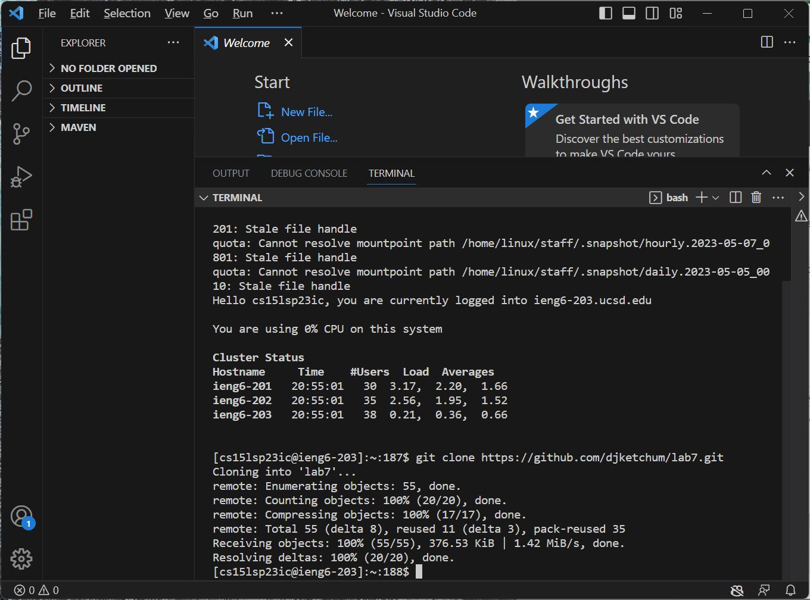

# Lab Report 4

## Step 4

To load the ieng6 account, I entered `ssh cs15lsp23ic@ieng6.ucsd.edu <Enter>`

## Step 5

To clone my fork of the lab7 directory, I entered `git clone https://github.com/djketchum/lab7/git` then <Enter> .

## Step 6

To demonstrate that the tests failed, I ran the test file using `bash test.sh <Enter>` .
  
## Step 7

To edit the code causing the tests to fail, I typed `vim ListExamples.java` `<Enter>` into the command line. This opened up the file in vim. I then typed `/change` which moved the cursor to the comment right above the line which needed to be fixed. I pressed <Enter>, then j 1 time and e 1 time to move the cursor to the end of the word 'index1'. 
  
## Step 7 continued

I then pressed x 1 time to delete the 1, and pressed i 1 time to enter insert mode. I pressed 2 1 time to place a 2 at the end of the word, making it index2 as it should be. I pressed <Esc> to exit insert mode, then :wq! to save changes and quit vim, going back to the main terminal.

## Step 8

I typed `bash test.sh` into the command line to show that the tests were running fine.
  

