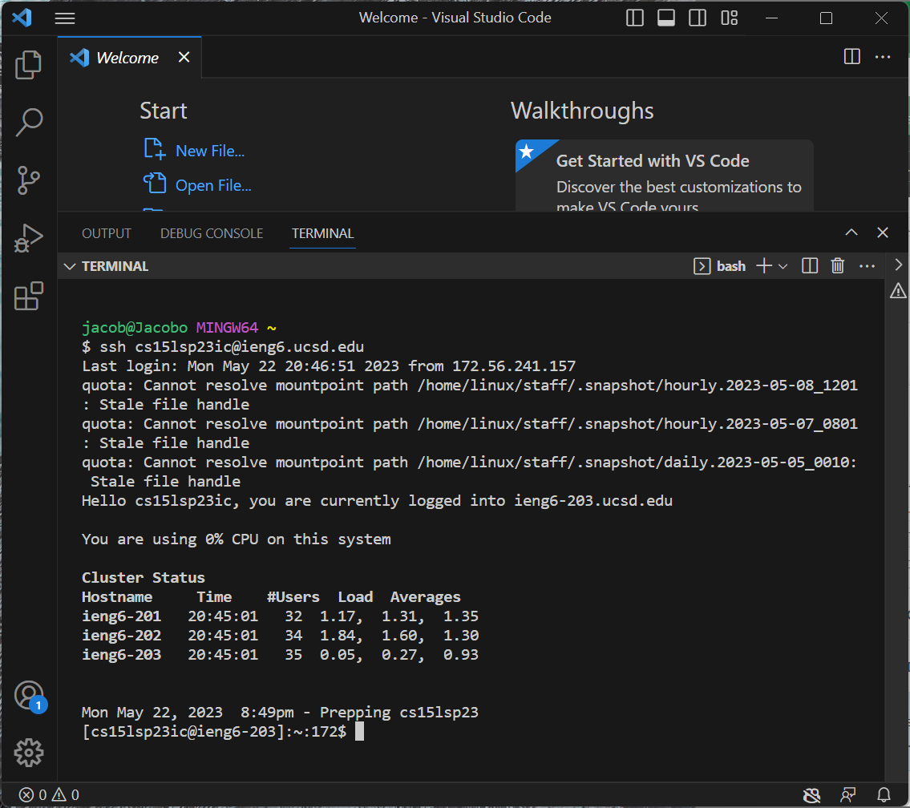

# Lab Report 4

## Step 4

To load the ieng6 account, I entered `ssh cs15lsp23ic@ieng6.ucsd.edu` , `<Enter>`

## Step 5

To clone my fork of the lab7 directory, I entered `git clone https://github.com/djketchum/lab7/git` then `<Enter>` .

## Step 6

To demonstrate that the tests failed, I ran the test file using `bash test.sh <Enter>` .
  
## Step 7

To edit the code causing the tests to fail, I typed `vim ListExamples.java` `<Enter>` into the command line. This opened up the file in vim. I then typed `/change` which moved the cursor to the comment right above the line which needed to be fixed. I pressed `<Enter>` , then `j` 1 time and `e` 1 time to move the cursor to the end of the word 'index1'. 
  
## Step 7 continued

I then pressed `x` 1 time to delete the 1, and pressed `i` 1 time to enter insert mode. I pressed `2` 1 time to place a 2 at the end of the word, making it index2 as it should be. I pressed `<Esc>` to exit insert mode, then `:wq!` to save changes and quit vim, going back to the main terminal.

## Step 8

I typed `bash test.sh` into the command line to show that the tests were running fine.
  
## Step 9

I first entered `git status` <Enter>, which showed me that I was on branch main, and that there was two changed files whose changes had not been committed. Although there was only one file, ListExamples.java, which should have been edited, I also made and removed an edit to ListExamplesTests.java at first, which is why that message appeared. I then entered into the command line `git add ListExamples.java` to add the changes in this file to the list of commits to be pushed to the origin. 

  
  
I reentered `git status` `<Enter>` to see that the changes I had committed using `git add` had successfully been added to the changes to be committed. I then typed `git commit` `<Enter>`  into the command line, which opened up vim. I pressed `i` once to enter insert mode, then entered `Committing the two java files ListExamples and ListExamplesTests.` I pressed `<Esc>` to exit, then `:wq!` to save and quit. 
  

  
I then entered `git status` , which showed me that my branch was 1 commit ahead of the main branch. I entered into the terminal `git push origin main` and was prompted for my username, to which I typed `djketchum` and pressed `<Enter>` . It then prompted me for my password and I pressed `Ctrl + V` to paste in the personal access token I had created, and `<Enter>` . It then made the push, and I double checked by re-entering `git status` `<Enter>` , which showed that my branch was up to date with main now. I didn't get the screenshot of the first time using git push due to technical difficulties so I included the above screenshot showing that the command returns a message saying everything is up to date.
 

