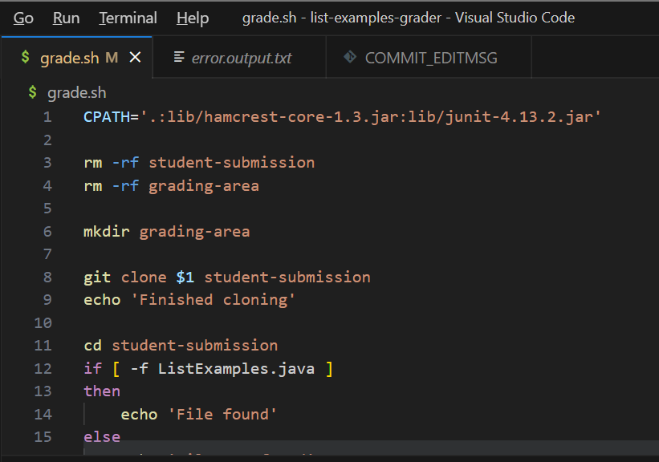
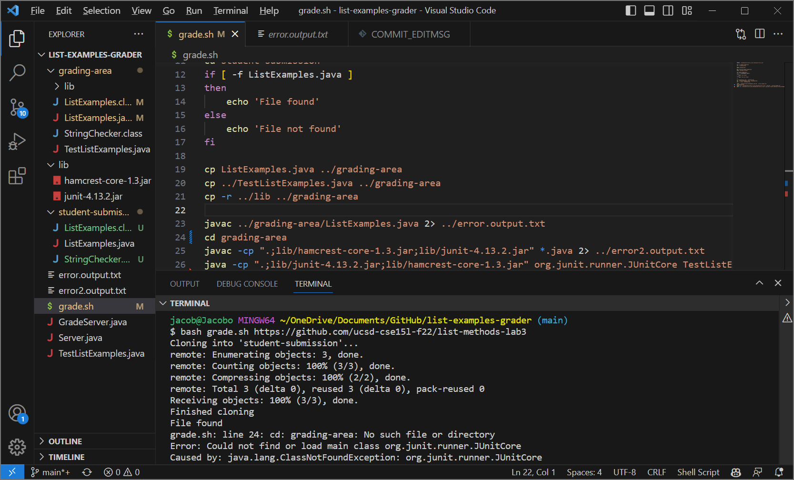
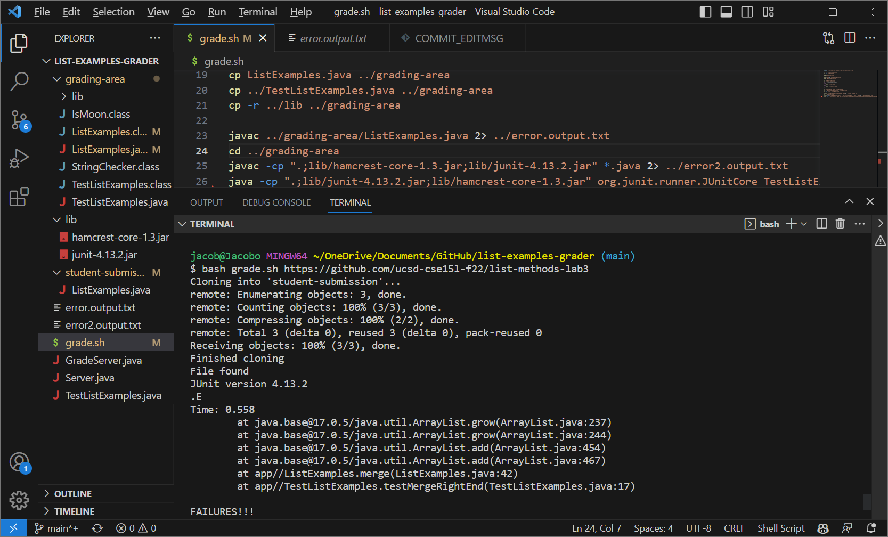

# Lab Report 5
## Step 1: Student Reporting Bug

**What environment are you using (computer, operating system, web browser, terminal/editor, and so on)?**

XPS 9305 Windows VS Code

**Detail the symptom you're seeing. Be specific; include both what you're seeing and what you expected to see instead. Screenshots are great, copy-pasted terminal output is also great. Avoid saying “it doesn't work”.**

I'm seeing an error saying that the directory grading-area is not found, even though I specifically created the directory grading-area using mkdir grading area early on in the file. 
For some reason the directory cannot be found so I can not change my file path to grading-area directory using 'cd grading-area' as I expected

**Detail the failure-inducing input and context. That might mean any or all of the command you're running, a test case, command-line arguments, working directory, even the last few commands you ran. Do your best to provide as much context as you can.**

The failure-inducing input is the command I ran which is shown in the screenshot above, and is simply running the grade.sh file using one of the example repositories provided on the course website. The current directory is the list-examples-grader directory, which is shown to contain the grading-area directory when doing an ls command, so I'm not sure why the cd command isn't working. 

## Step 2: TA Response
Hi, thanks for the information. It looks like you may be confused on what directory you are actually in by the time you hit the line in your file which produces the bug, which is the `cd grading-area` line. Previously in your file you used the cd command to switch into the sub-directory student-submission, so that is the directory you are currently running in when you reach that line. This means you are trying to use cd from one subdirectory to another subdirectory, which is causing the error since the subdirectory student-submission cannot directly access the subdirectory grading-area. How can you change the syntax around your cd grading-area command so that you are checking in a place where it will be visible, and not in the subdirectory you are currently in? (Hint: you used the correct syntax earlier in the file)

## Step 3: Student Updated Screenshot

The student was able to use the TA's advice to correct the issue by adding the ../ in front of grading-area. The bug was caused by an incorrect syntax with the change directory command. Since the current directory was student-submission, which is a subdirectory of list-examples-grader just like grading-area, in order to cd to another subdirectory you have to include the ../, which is effectively like typing out  ~/OneDrive/Documents/GitHub/list-examples-grader/grading-area, since the .. refers to the 'previous' path when removing the last element, in this case student-submission.

## Step 4: Setup Info
I used the lab7 repository, and the bug only involved the grade.sh file. The contents of the file are shown in the screenshots above, however the line that was changed is line 24, changing from `cd grading-area` to `cd ../grading-area` . The full command line I ran to trigger the bug is `bash grade.sh https://github.com/ucsd-cse15l-f22/list-methods-lab3`. I fixed the bug by adding ../ in front of grading-area when using the cd command.

## Reflection
Something cool that I learned this second half of the quarter is how to use vim on files so that you can remotely access a git repo using git clone, then open and edit the files using vim, rather than having to have the folder downloaded on your computer and opening it in VS Code. This is cool because it teaches me how to do more using programming. Along the same lines, I also learned to commit and push to github from the command line. All in all I learned many ways to carry out tasks solely from a terminal that I previously would've gone into several applications like Github, Github Desktop, and my computer's Documents to be able to do. 

